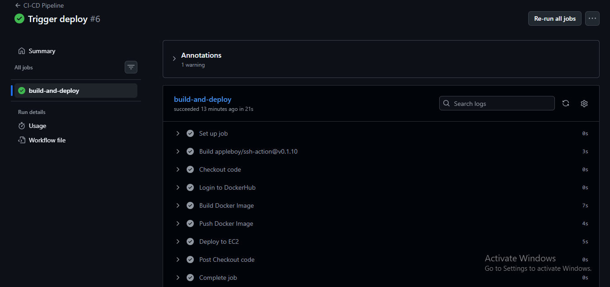
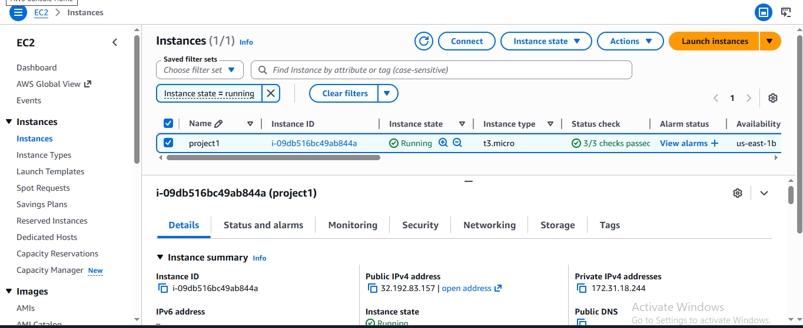
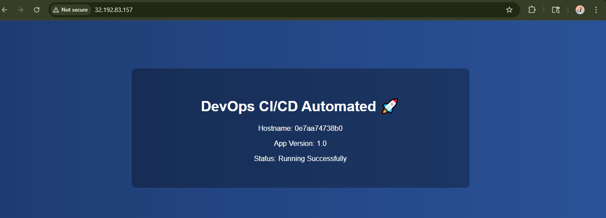

# 🚀 Flask DevOps CI/CD Project

A production-style DevOps project demonstrating containerization, CI/CD automation, and AWS deployment using GitHub Actions, Docker, and EC2.

---

## 📌 Project Overview

This project showcases a complete CI/CD pipeline that:

* Containerizes a Flask application using Docker
* Pushes Docker images to DockerHub
* Automatically deploys to AWS EC2 using GitHub Actions
* Uses Nginx as a reverse proxy
* Exposes the application via public IP

---

## 🏗️ Architecture

```
Developer
   │
   ▼
GitHub Repository
   │
   ▼
GitHub Actions (CI/CD)
   │
   ▼
DockerHub (Image Registry)
   │
   ▼
AWS EC2 (Ubuntu)
   │
   ▼
Docker Container (Flask App)
   │
   ▼
Nginx Reverse Proxy
   │
   ▼
Public IP (Port 80)
```

### Workflow

1. Code pushed to GitHub
2. GitHub Actions builds Docker image
3. Image pushed to DockerHub
4. GitHub Actions connects to EC2 via SSH
5. Pulls latest image
6. Stops old container
7. Runs new container
8. Nginx routes traffic to container

---

## 🛠️ Tech Stack

* Python (Flask)
* Docker
* GitHub Actions (CI/CD)
* DockerHub
* AWS EC2 (Ubuntu)
* Nginx
* SSH Authentication

---

## 📂 Project Structure

```
.
├── app.py
├── requirements.txt
├── Dockerfile
├── .github/workflows/deploy.yml
└── README.md
```

---

## 🐳 Docker Setup

### Build Image

```
docker build -t flask-devops-app .
```

### Run Container

```
docker run -d -p 5000:5000 flask-devops-app
```

---

## ⚙️ CI/CD Pipeline (GitHub Actions)

On every push to the `main` branch:

* Build Docker image
* Login to DockerHub
* Push image
* SSH into EC2
* Pull latest image
* Restart container automatically

### 🔐 GitHub Secrets Used

* DOCKER_USERNAME
* DOCKER_PASSWORD
* EC2_HOST
* EC2_USERNAME
* EC2_SSH_KEY

---

## ☁️ AWS EC2 Setup

* Ubuntu EC2 instance
* Docker installed
* Nginx installed and configured as reverse proxy
* Security group allows:

  * Port 22 (SSH)
  * Port 80 (HTTP)

---

## 🔐 Nginx Reverse Proxy Configuration

```
location / {
    proxy_pass http://127.0.0.1:5000;
    proxy_set_header Host $host;
    proxy_set_header X-Real-IP $remote_addr;
}
```

---

## 📈 Key DevOps Concepts Demonstrated

* Containerization
* CI/CD automation
* Infrastructure deployment
* SSH-based remote deployment
* Reverse proxy configuration
* Secure secret management
* Zero-downtime container replacement

---
## 🏷️ Versioning Strategy

This project uses automated semantic-style version tagging:
- v1.<run_number>
- latest tag maintained for stable deployment

## ❤️ Container Health Monitoring

Docker HEALTHCHECK is implemented to ensure:
- Application availability
- Automatic container health validation
- Production-ready monitoring support
---

## 📸 Project Screenshots

### ✅ GitHub Actions Pipeline Success



### ☁️ AWS EC2 Running Instance



### 🌐 Application Running in Browser

 
## ⚠️ Deployment Note

This project was deployed on **AWS EC2 (Ubuntu)** in an ephemeral cloud environment.
Since EC2 instances may be short-lived for cost optimization, screenshots and CI/CD workflow serve as deployment proof.

---

## 🎯 Resume Description

Implemented a complete CI/CD pipeline to build, containerize, and automatically deploy a Flask application to AWS EC2 using GitHub Actions, Docker, and Nginx.

---

## 🚀 Future Improvements

* Add Docker image version tagging
* Implement Docker Compose
* Add HTTPS with Let's Encrypt
* Infrastructure as Code using Terraform
* Add Monitoring (Prometheus + Grafana)

---

## 👨‍💻 Author

**Rohit Bhatt**
---

## 🧠 What This Project Proves

✔ Understanding of CI/CD pipelines
✔ Real-world deployment workflow
✔ AWS cloud deployment experience
✔ Production-ready Docker usage
✔ Secure key-based authentication

---

⭐ If you found this project helpful, consider giving it a star!
